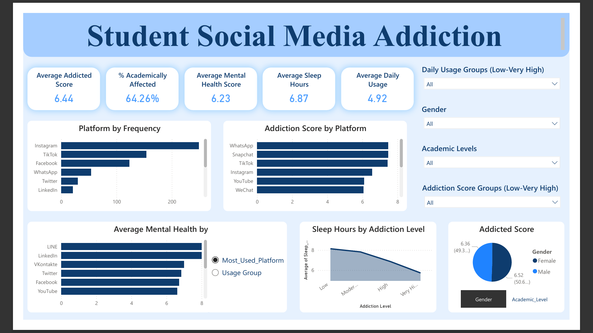

# Student Social Media Addiction Power BI Dashboard

## Project Overview

This project analyzes social media addiction patterns among students using an interactive Power BI dashboard. The dataset contains 705 student records across 13 variables, covering usage behavior, academic impact, mental health, and sleep patterns.

The objective is to understand how daily social media usage affects student well-being and academic performance while identifying trends across platforms and demographics.

---

## Dashboard Preview



---

## Project Structure

```
Student Social Media Addiction Power BI Dashboard
│
├── data
│   └── Students Social Media Addiction.cvs
│
├── dashboard
│   └── Student Social Media Addiction Dashboard.pbix
│
└── images
    └── dashboard-preview.png
```

---

## Dataset Information

- Total Records: 705  
- Total Columns: 13  
- Countries Represented: 110  
- Genders: 2  
- Academic Levels: 3  
- Social Media Platforms: 12  

### Key Columns

- Avg Daily Usage Hours  
- Addiction Score  
- Mental Health Score  
- Sleep Hours Per Night  
- Academic Performance Impact  
- Most Used Platform  

---

## Key Metrics (Overall Averages)

- Average Addiction Score: 6.44 / 10  
- Average Daily Usage: 4.92 hours  
- Average Sleep Duration: 6.87 hours  
- Average Mental Health Score: 6.23 / 10  
- Students Academically Affected: 64.26%  

---

## Dashboard Features

### KPI Cards

- Average Addiction Score  
- % Academically Affected  
- Average Mental Health Score  
- Average Sleep Hours  
- Average Daily Usage  

### Visualizations

- Platform Usage Distribution  
- Addiction Score by Platform  
- Mental Health Score by Platform  
- Sleep Hours vs Addiction Level  
- Addiction Score by Gender  

### Filters

- Gender  
- Academic Level  
- Usage Group  
- Addiction Score Group  

---

## Key Insights

- Nearly 64% of students report academic impact due to social media usage.  
- Students spend nearly 5 hours per day on average on social platforms.  
- Higher addiction levels are associated with reduced sleep duration.  
- Behavioral patterns vary across platforms and demographic groups.  

---

## Tools & Technologies

- Power BI  
- Data Cleaning & Transformation  
- Data Modeling  
- DAX Calculations  

---

## Conclusion

This project demonstrates end-to-end data analysis — from raw dataset preparation to interactive dashboard creation. It highlights how behavioral data can be transformed into actionable insights to better understand student digital habits and their real-world impact.
